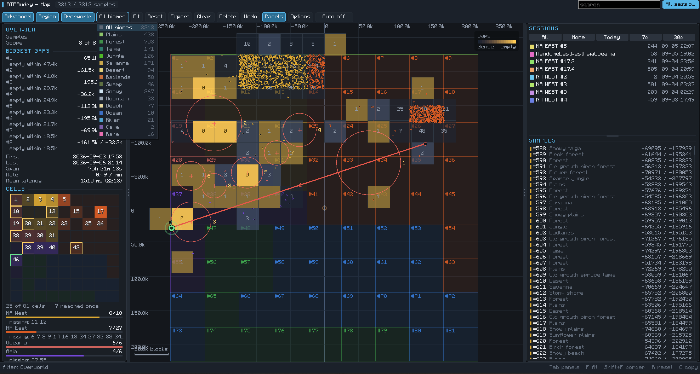
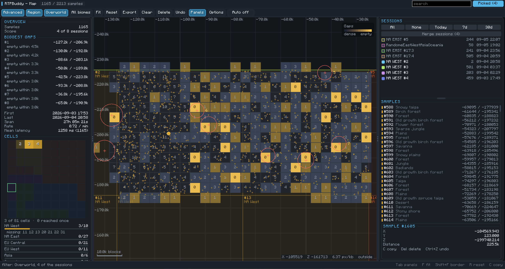
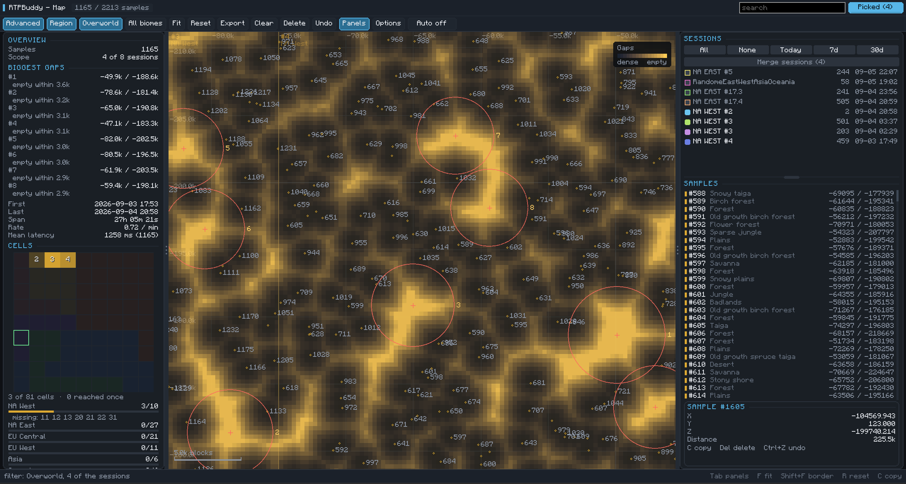
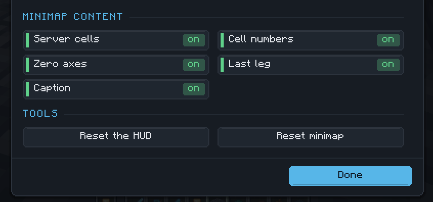
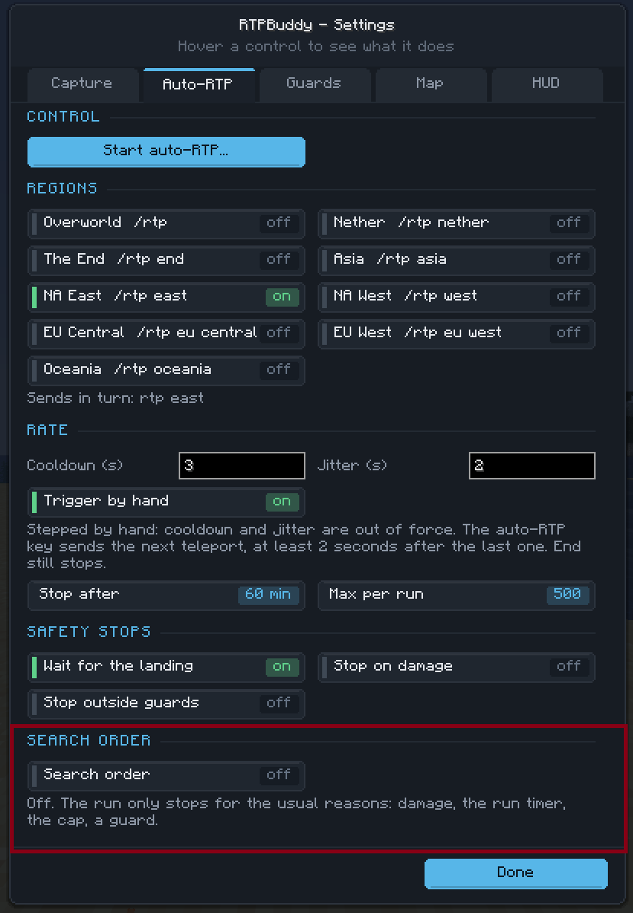
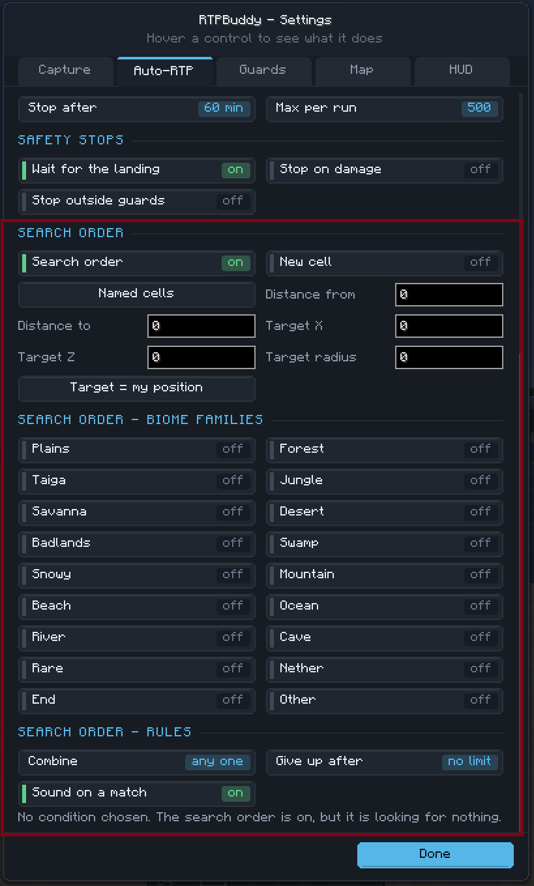
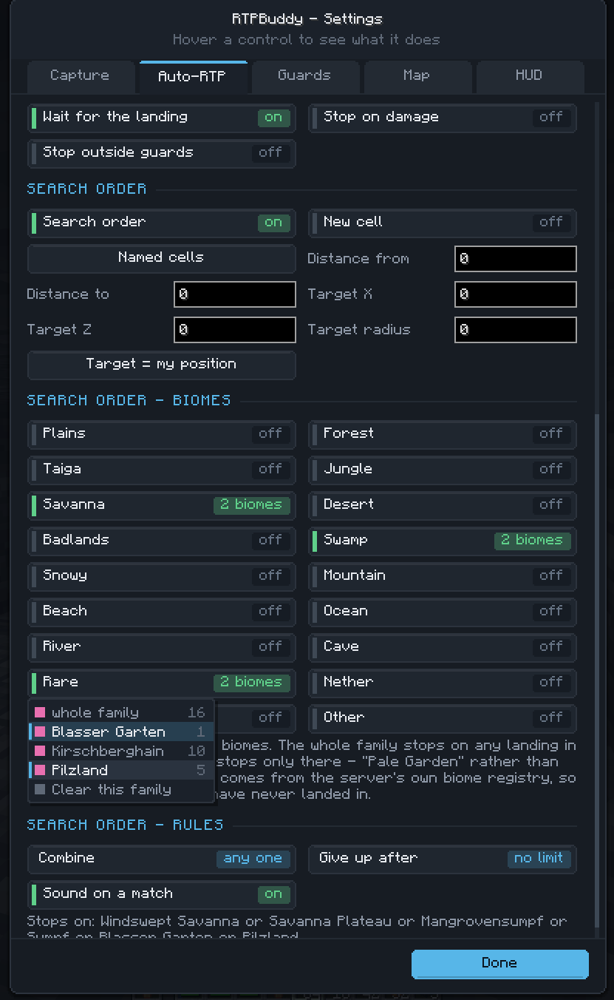

# RTPBuddy

A client-side Fabric mod that maps where `/rtp` (random teleport) actually drops
you.

RTPBuddy records every landing, draws a **map** of them — this sitting, or
everything you have ever recorded, switched with one button — and reports what
the numbers say about the teleport distribution. It carries one
feature that acts on its own — an **auto-RTP loop** — and that one is **off until
you start it by hand** and never restarts itself.

What the mod never does: automate movement, combat or inventories, spoof
coordinates, alter packets, shorten or bypass a server cooldown, or attempt to
evade anti-cheat. Mapping itself is entirely passive — it watches the commands
you type and your own client position, nothing more. There is no pathing or
mining integration of any kind.

The one thing that does act for you is auto-RTP, which repeats the single command
you configured at the interval you chose. Whether that is allowed differs per
server; on DonutSMP it is. Check your server's rules.



*Every landing ever recorded, over DonutSMP's grid of 81 server cells. The
board bottom left tracks which cells have been reached, the red leg points at
the newest landing, and the open menu filters by biome.*

## Contents

- [Requirements](#requirements)
- [Build](#build)
- [Install](#install)
- [Using it](#using-it)
- [Testing without a server](#testing-without-a-server)
- [Language](#language)
- [Commands](#commands)
- [Features in detail](#features-in-detail)
  - [Capture](#capture)
  - [Settings](#settings)
  - [Auto-RTP](#auto-rtp)
  - [The maps](#the-maps)
  - [Advanced: the gap map](#advanced-the-gap-map)
  - [Clicking a landing](#clicking-a-landing)
  - [Server regions on the plot](#server-regions-on-the-plot)
  - [Markers and the hover card](#markers-and-the-hover-card)
  - [The minimap](#the-minimap)
  - [The cell board](#the-cell-board)
  - [The search order](#the-search-order)
  - [Biome colours and filters](#biome-colours-and-filters)
  - [Drawing a full map](#drawing-a-full-map)
  - [Deleting samples](#deleting-samples)
  - [Sessions and scope](#sessions-and-scope)
  - [The map screen while you play](#the-map-screen-while-you-play)
  - [World borders](#world-borders)
  - [What the metrics column reports](#what-the-metrics-column-reports)
- [Data storage](#data-storage)
- [Desktop viewer](#desktop-viewer)

---

## Requirements

- Minecraft Java Edition 1.21.11
- Java 21
- Fabric Loader 0.19.3 or newer
- Fabric API 0.141.6+1.21.11

---

## Build

```bash
./gradlew build
```

On Windows:

```powershell
.\gradlew.bat build
```

Build with Java 21 (`JAVA_HOME` pointing at a Java 21 install). The remapped
production JAR lands in `build/libs/` as `rtpbuddy-1.6.14.jar`.

---

## Install

Download `rtpbuddy-1.6.14.jar` from the
[Releases page](https://github.com/Yukitus86/RTPBuddy/releases/latest),
or build it yourself with the step above.

1. Install Fabric Loader for Minecraft 1.21.11.
2. Put Fabric API for 1.21.11 in the instance's `mods` folder.
3. Put `rtpbuddy-1.6.14.jar` in the same `mods` folder.
4. Start Minecraft with the Fabric profile.

> [!NOTE]
> The JAR is client-only. It is neither needed nor intended on the server.

---

## Using it

| Key | Action |
|---|---|
| `M` | Map, at whatever scope you last used |
| `K` | Record a sample manually |
| `H` | Auto-RTP: start, then hold and continue |
| `O` | Settings |
| `End` | Immediate stop of the auto-RTP loop |

All of them are rebindable under Controls, in the **RTPBuddy** category.

Five keys, and the auto-RTP one carries the whole run. With nothing running it
opens the start dialog. With a run on the clock it **holds** it rather than
ending it: nothing is sent, the wait and the run timer both freeze, and damage or
a guard violation end nothing while it holds; pressing it again continues with
the wait that was left, the same counters and the same place in the region
rotation. With a run stepped by hand it sends the next teleport. Stopping is
`End`'s job alone, which is the point - the one irreversible action sits on a key
of its own rather than one press away from a hold.

Capture used to have a pause key and the hold used to have one of its own. Both
went: a switch you set once a session does not need a key, and a second key that
only half-stopped the loop was one too many to keep straight in a hurry. Both
still work from chat - `/rtpbuddy capture pause`, `/rtpbuddy auto pause` - and
from the settings.

`End` is the immediate stop. It works from anywhere, including while a RTPBuddy
map or the settings are open — a plain key binding would be dead there, which is
exactly when a running loop is most likely to need stopping. It halts the
auto-RTP loop and reports precisely what it stopped. With nothing running it
leaves the key alone, so `End` still moves the caret in a text field.

---

## Testing without a server

RTPBuddy only records; it never teleports you. Recording therefore needs
something that answers `/rtp` — the server you are on, or in single player any
mod that provides the command. RTPBuddy watches the outgoing command packet and
does not care which.

> [!TIP]
> With no such command available, record by hand instead: `K`, or
> `/rtpbuddy capture manual [region]`, writes a sample at wherever you are
> standing, which is enough to exercise the store, the map and the statistics.

---

## Language

The interface follows the language selected in Minecraft's own options: German
with the game set to German, English otherwise. Both translations ship with the
mod and no setting of its own is involved.

---

## Commands

Every one of these is client-side; no packet reaches the server.

```text
/rtpbuddy map | all | config
/rtpbuddy minimap [on | off | place]
/rtpbuddy stats [all] | export [all]
/rtpbuddy capture pause | resume | manual [region]
/rtpbuddy auto status | start | stop | pause | resume
/rtpbuddy cells
/rtpbuddy find [on | off]
```

---

## Features in detail

### Capture

Capture is passive. When you send a command matching one of the configured
region patterns, RTPBuddy notes where you were and waits; when your position
jumps past the threshold (200 blocks by default) or the dimension changes, it
waits for the position to settle and then records the landing. If no teleport
follows within the timeout, it quietly gives up and says so on the HUD.

The bundled preset matches DonutSMP's `/rtp`, `/rtp nether` and `/rtp end`, plus
the six server zones that `/rtp` takes as an argument there - `asia`, `east`,
`west`, `eu central`, `eu west` and `oceania`. The patterns are ordinary regular
expressions in `config.json`, so any server works. A config written by an older
release gains the new regions on first start; regions you edited or renamed are
never touched.

An `/rtp` whose destination is not in the region list is still recorded, as long
as **Record unknown /rtp** is on: the argument is kept verbatim as the requested
region rather than being dropped or mapped onto the nearest configured one.

### Settings

Press `O`, click **Settings** on either map, or run `/rtpbuddy config`. Five tabs:

- **Capture** — capture on/off, auto-capture from commands, capture on dimension
  change, rejecting short jumps, the CSV mirror, the teleport distance threshold,
  the arm timeout, the settle delay, the save debounce, and re-applying the
  bundled region preset.
- **Auto-RTP** — start/stop, hold/continue, which regions to request (tick as
  many as you like), the order they are used in, cooldown, jitter, run timer,
  teleport cap, whether to wait for each landing, and the stop conditions.
- **Guards** — border radius per dimension and guard band, border centre and shape, spawn
  position and guard radius, and a button that takes your current position as
  spawn.
- **Map** — remembering pan and zoom, remembering the filter, hiding empty
  sessions, every overlay toggle, marker shape and size, the density cell size,
  the frame cap, and whether the map is held open through a teleport.
- **HUD** — where the two overlays sit, how big they are, how solid their
  backing plates are, which of the text overlay's six rows it shows, and what
  the minimap draws. **Place the overlays** opens a screen where both boxes are
  dragged into place over the running game.

The overlay itself reads as a small block rather than a line of run-together
values: the capture state, the session counters, then the last landing as its
number and region - painted in that region's colour, with the DonutSMP server
number beside it - its biome and dimension underneath, and the coordinates with
the distance from origin last. Every row can be switched off on its own.

### Auto-RTP

Auto-RTP sends the configured command so a map fills in without typing `/rtp`
hundreds of times - on a timer, or one teleport per key press. Start it with
`H`, the **Auto** button on either map, or `/rtpbuddy auto start`; the button doubles as the countdown, and the HUD
shows how many it has sent.

Tick as many regions as you want in the **Regions** section of the tab and the
loop walks them one per teleport - `rtp asia`, then `rtp eu central`, then
`rtp east`, then round again - with **Round robin** giving every zone the same
number of samples and **Random** picking one each time. On a server where a
plain `/rtp` keeps handing back the same zone, this is the only way to fill in
the rest of the map. One region ticked behaves exactly like the single-region
setting it replaces, and the start dialog names the whole rotation before
anything is sent.

`H` holds a run instead of ending it: nothing is sent, the wait and the run
timer both freeze, and damage or a guard violation stop nothing while it holds —
what you take while standing around looking is yours, not the loop's. Pressing it
again continues with the wait that was left, the same counters and the same
place in the rotation. There is a button for it in the tab while a run exists,
and `/rtpbuddy auto pause` and `resume` do the same from chat. The map's Auto
button reads *Auto held* rather than showing a countdown that never moves.

**Trigger by hand** turns the clock off entirely. The run stays a run - the
rotation, the counters, the caps, the run timer and every stop condition behave
exactly as they do on the timer - but nothing is sent until you press the
auto-RTP key, one teleport per press. It is for the other half of the job:
filling a map and looking at where you landed want different rhythms, and the
second one is yours to set rather than a rate you had to guess in advance. There
is no countdown, so none is shown: the HUD reads `MANUAL` and the map button
*Auto manual*. Cooldown and jitter no longer apply, bar a floor of two seconds
between commands so a held key cannot turn into a command every tick.

A press that cannot be honoured refuses rather than queues, and says why - the
last landing is still being recorded, the floor has not elapsed, the run is held.
A press that silently fires later is worse than one that does nothing: knowing
when the command went out is the entire point of stepping by hand. A press that
worked says nothing at all, because the command is already in the chat, the
server answers it, and the HUD counts it. `/rtpbuddy auto step` does the same
from chat.

It is off by default and the running flag is never written to disk — it starts
stopped on every launch. A run stops on:

- a **disconnect**
- a **world join**
- **damage** taken
- the **run timer** running out
- the **teleport cap** being reached

The interval is measured between *landings*, not between attempts, so a slow
teleport does not stack up commands. Jitter keeps the spacing from being
machine-exact. It never shortens or bypasses a server cooldown: if the server
refuses a teleport, the next attempt simply waits out the same interval again.

> [!IMPORTANT]
> Whether repeating a command is allowed differs per server — on DonutSMP it is —
> so the start dialog states exactly what will be sent, how often and every
> condition that ends the run, and sends nothing until you press start. It
> informs; the decision stays yours.

The literal command per region lives in `config.json` next to the match pattern,
because a regex cannot be run backwards into the one command a server expects.

### The maps

Both maps share the same canvas:

| Input | Action |
|---|---|
| Drag | Pan |
| Scroll | Zoom on the cursor |
| `F` | Fit everything in view |
| `R` | Reset the view |
| `Tab` | Show or hide the side panels |
| Arrow keys | Step between samples |
| Shift-drag | Rectangle selection, summarised in the status line |

Sample numbers appear next to the markers **from the 5k scale onward**: while the
bar in the bottom left reads more than 5,000 blocks they stay off, because at that
range the plot is about where landings fell rather than which ones they were.
Zoomed in past that, crowding decides as well - if more than a fifth of the markers
in view would share a label-sized patch, the numbers stay off rather than smearing
over the markers they label. Stating the rule against the scale bar rather than a
zoom figure keeps it readable off the screen.

Every plot draws one line without being asked: from the point the newest landing
started at to the landing itself, in red, with an arrow the way it went. It is
taken from that sample's own recorded origin rather than from the sample before
it - the two are usually the same point and sometimes are not, since you walk,
you fall, you take a portal, and only the recorded origin is a fact about that
teleport. Watching the map while a run goes, it answers which of the dots you
just came from without clicking one. Left out across dimensions, where a straight
line measures nothing, and switched off under **Settings → Map → Line into the last
landing**.

The map is held open through a teleport. A jump across worlds normally brings up
the game's own loading screen and throws away whatever was open, so with the auto
loop running the map shut on every single landing; RTPBuddy declines that one
swap instead, and the same screen stays up with its filter, zoom, scroll position
and selection intact. Only the game's transient loading screens are refused -
anything you or the server opens on purpose comes through, and escape still means
closed. It is **Settings → Map → Hold the map open through a teleport**.

Your own position is drawn as a ring with a dark collar around it, a short
one-pixel stub from its centre for the direction you face, and a slow ripple that
fades outward - the one moving thing on the plot, which is what makes the marker
findable again after a teleport has moved it. The ripple is
**Settings → Map → Player marker ripples** if it is not wanted.

**Start a new sitting** at the bottom of the session card closes the sitting in
progress and opens the next one without relogging: the sample numbers start at 1
again and the card's counters reset with them. Nothing is deleted - the landings
recorded so far keep the sitting they were taken in.

Samples count from 1 inside a sitting. A new session starting at "#297" read as
yesterday's run continuing, so a view showing one sitting numbers its landings
from 1. That follows what is actually on the plot rather than the scope: pick a
single sitting in the all-sessions list and it counts from 1 there too. Only once
two sittings share the plot does the global number take over, which is the one
that stays unique across sittings and the one the CSV, the viewer and the delete
dialog mean. The stored number never changes either way.

The sample list is number, biome, coordinates, and its scrollbar sits in a strip
of its own, so dragging it scrolls instead of picking the row behind it. The
dimension, region and mode filter is remembered between openings
(**Settings → Map → Remember filter**), and sittings that recorded nothing are kept
out of the session list, with a **Delete empty sessions** button offered there
while any exist - the running sitting is never among them.

The two side panels are resizable: drag the divider between a panel and the map,
and double-click a divider to put that panel back to its default width. The
widths are kept as a fraction of the window, so they survive a resize and a GUI
scale change rather than swallowing the screen at scale 4; the map keeps a
minimum width of its own, so a drag can never squeeze it away. **Settings → Map → Reset panel widths** restores both at once.

Markers can be drawn as points, a path in recording order, or **Advanced**, and
coloured by dimension, region, session or recency; a colour key in the corner
says what the current colouring means. Points draws the dots and
nothing else; path draws the route between them in recording order, one pixel
wide with a direction chevron per segment and hollow markers behind it.

### Advanced: the gap map

The other two modes draw the landings. This one draws what is not there, and it
replaced the heatmap and the cluster view outright. All three were about density;
this is the only one of them that says something about the *ground* rather than
about the dots, and once it existed the other two had nothing left to answer.

Every point of the plot is shaded by how far it lies from the nearest recorded
landing - dark where they are dense, amber where nothing has ever come up. The
biggest holes are ringed and numbered on the map and listed in the metrics
column with their coordinates and radius, and the cursor line reads out the
distance under the pointer.

It exists because absence has no marker to draw. Shade the landings instead - as
the heatmap did - and a dark patch means three different things at once: never
landed there, the filter hid it, or nothing on the server sends you there, with
nothing on screen to tell them apart. Measuring the distance to the nearest
landing turns the absence itself into a value that can be shaded, ranked and read
off.



*Zoomed out past the 5k scale: the ground is cut into fixed world tiles, each
carrying its own landing count in four bands.*



*Zoomed in under it: the field itself is shaded by distance to the nearest
landing, dark where they are dense, amber where nothing has ever come up. The
eight biggest holes are ringed and listed with their coordinates.*

Two pictures, one measurement. Up to the 5k scale the field is shaded, because
close in a hole is a shape with edges. Past 5k the same ground is cut into fixed
world tiles carrying their own landing count in four bands - none, one, two to
three, four and more - because a shape a few pixels across is not a shape and a
number is. The switch is the same 5k landmark the sample numbers use, so the map
has one rule to remember rather than two. Tiles snap to a fixed multiple of the
world origin, so the same square keeps its identity between sittings and can be
ticked off a list.

Distance on its own would always name the edge of the canvas as the emptiest
place, since nothing has been recorded past it. The measurement is therefore
bounded by a mask: the recording's own footprint, filled in. The tile size is
only a strip width - the landings are cut into strips that many blocks tall and
that many wide, and a point is inside when it lies between the leftmost and
rightmost landing of its row strip **and** between the topmost and bottommost of
its column strip. Holes in the middle stay inside, which is the whole point,
while the outer edge lands on the outermost *landing* rather than a tile edge
past it. Inside the mask, "nothing here" is a fact about the server; outside it,
it is only a fact about how far the recording has got, and it is dimmed to say
so. **Settings → Map → Gap search area** sets the strip width, **Listed gaps** how
many holes are ringed.

The strips are measured against real coordinates rather than tile edges because
the tile-aligned version left a column of never-visited ground standing along the
left and the bottom - honestly empty, and completely useless: empty because
nobody has looked there yet, not because the server avoids them. A wider strip is
coarser but more robust; a narrower one hugs the recording harder but starts to
fragment, and a hole can drop out of the mask entirely. 16,000 is where it holds
both.

Two rules keep the tiles honest when the view moves. The mask is asked in **world
units**, never through a screen pixel: asking through the clipped centre of a
tile that hangs off the edge made the outer row and column blink in and out on a
drag, because the probe walked across the tile while the tile stood still. And a
tile holding a landing is drawn whatever the mask says - the mask is not
tile-aligned, so a tile whose middle falls just outside it can still hold
landings in a corner, and a marker sitting on bare ground with no tile under it
reads as a bug.

A hole that touches the frontier is still ranked. The field goes on rising into
unexplored ground, so no cell inside the mask is a peak there; a neighbour
outside the mask therefore does not count as higher. Without that the biggest
hole on the map is the one that goes missing from the list.

Filter to one region first. The measurement already handles overlap correctly - a
spot reachable through two regions is only rare if it is rare in both, and the
distance to the nearest landing of either says exactly that - but a hole in the
region you care about will be filled in by landings of a region you never asked
for there.

A radius is rounded down rather than up, so it under-promises: the patch is at
least that empty. The field is measured on a screen-space grid, and a cell is
worth a few hundred blocks when a whole region is in view, so the figure is
shortened by about that much rather than sending you to a clearing that turns out
to have a landing in the middle of it.

The shading is uploaded to the GPU once per rebuild and drawn as a single quad.
Drawing it as one rectangle per cell was the obvious way and the wrong one: on
1.21.11 every `fill` allocates a render-state object and a copy of the matrix, so
a few thousand cells is a few thousand allocations on every frame of a zoom.

### Clicking a landing

Clicking a landing draws the two legs that touch it: red for the leg that
arrives, green for the leg that leaves, both thicker than the rest of the route
and drawn on top of it. So one click answers where you came from and where the
next RTP took you - in the path view and in points, where those two lines are
the only ones drawn. A leg that crosses dimensions is left out, because a
straight line between two different worlds measures nothing.

### Server regions on the plot

**Region** means the server region, not the dimension. DonutSMP splits its
overworld into 81 cells of 50,000 blocks over the playable area and hands each
cell to one of six server locations - NA East, NA West, EU Central, EU West,
Asia, Oceania. That grid is drawn under the plot, each cell tinted in the colour
of the region that owns it and labelled with its server number, and a landing
takes the colour of the region it fell in. Whether a plain `/rtp` spreads across
the whole world or keeps you in one region is not something this mod claims -
it is what the recorded landings are there to show. It is switched on in **Settings → Map → Server region
grid**, and appears only for samples recorded on a host that uses it: painting
that layout over a single-player world would be inventing a fact. Everywhere
else a region stays what the command asked for.

### Markers and the hover card

Markers are discs by default, two pixels of radius. Both are settings:
**Settings → Map → Round markers** and **Marker size**. The viewer reads the same
two values out of `config.json`, so the two tools draw the same dot.

Hovering a marker gives the full record on a card rather than a stack of
labelled lines: the sample number and its server region in the header, the
coordinates on a band of their own, dimension and biome under them, the
measurements — distance, jump, gap since the previous sample, capture latency,
surface Y — paired off in two columns, and the timestamp, capture mode and
server in a dim footer. A stripe down the left edge carries the dimension
colour.

The sample list carries the same three facts per row: number, biome and
coordinates. The biome drops out when the panel is too narrow to hold it.

### The minimap

The map screen answers where you are, and charges a key press and a paused view
for it. The minimap answers the same question without either: a small plate in a
corner of the game screen, framing exactly the rectangle `F` would frame on the
full map, with your own marker moving about inside it.

It is not a terrain minimap and does not try to be one. What it draws is the
recording: the server's 50,000 block cells tinted by the region that owns them,
their numbers written in where they fit, your landings as single pixels, the red
leg into the newest one, and the world axes. Underneath sits a strip naming the
cell you are standing in — region and server number, in that region's colour —
and how much ground the plate covers.

The frame is **fixed**. It holds the chosen landings and does not scroll with
you, because a frame that recentres on every step tells you nothing about where
you are in the recording as a whole. Walk out of that rectangle and your marker
is pinned to the rim in amber rather than drawn where it cannot be seen. With
nothing recorded yet the plate frames the server cell you are standing in
instead, which is still an answer.

It is **off the frame path almost entirely**. The plate is painted once into a
texture and then redrawn as a single quad; a thousand landings would otherwise be
a thousand `fill` calls in every frame of every fight, which is the mistake the
gap map very nearly shipped with — made permanent, because a minimap is on screen
the whole session. The picture is repainted only when it actually changes: a new
landing, a different sitting, a switch flipped, or the player crossing into
another server cell. A repaint measures under 3 ms with two thousand landings on
it. What is redrawn per frame is your marker, up to sixteen cell numbers and the
caption — some fifty rectangles, about what one vanilla HUD widget costs.



*What the plate draws is switched row by row under **Settings → HUD**.*

Its position works exactly like the text overlay's: **Settings → HUD → Place the
overlays** puts both boxes on the running game to be dragged, `Tab` switches
between them, and each is stored as a corner plus an offset so it stays put
through a resize or a GUI scale change. `/rtpbuddy minimap` switches it on and
off from chat, `/rtpbuddy minimap place` opens the placement screen. It defaults
to the bottom right, out of the way of the text overlay in the top left and of
whatever another minimap mod has claimed in the top right.

### The cell board

On a server with a region grid the metrics column opens with a nine-by-nine
board, one square per cell. A cell holding landings is filled in its zone's
colour, more of it the more landings it holds; a cell reached exactly once
carries a gold ring, because a single deleted landing would empty it again. The
cell you are standing in is ringed in green. Under the board sit the per-zone
bars - `7/10`, `6/27` - each with the numbers of the cells that zone is still
missing.

This is the coverage figure the percentage next to it cannot be. The density
coverage divides by a disc whose size depends on the cell edge you happen to
have set, so its value only means something against itself; the grid has
eighty-one cells whatever anyone configures, so *22 of 81* is a sentence with a
finish line in it.

A zone with no landings at all is drawn dim and sorted to the bottom. That is
not a gap in the map - it is a zone that has never been asked for, and listing
its cells as missing would put fifty-odd squares on a to-do list nothing has
ever tried to reach.

`/rtpbuddy cells` prints the same thing to chat. Landing in a cell no stored
landing has ever reached says so in chat and pulses that cell on the minimap for
a few seconds.

### The search order

Auto-RTP stops for damage, for the run timer, for the session cap and for a
guard - every one of them a reason to give up. A search order is the other kind:
a reason to stop because the run found what it was sent out for. Under
**Auto-RTP → Search order**, switch it on and pick conditions:

- **New cell** - the first landing in a cell no stored landing has ever reached.
- **Named cells** - a typed list such as `11 12 20`.
- **Biome families** - eighteen of them, from *Plains* to *Rare*, which is where
  mushroom fields, cherry groves and the pale garden live.
- **Distance from / to** - a band measured from the world origin.
- **Target point and radius** - stop within so many blocks of a coordinate;
  **Target = my position** fills it in from where you stand.



*The Auto-RTP tab with the search order still off: the run stops only for the
usual reasons. The red frame marks the section, and is drawn on the screenshot
rather than by the mod.*



*Switched on, the whole section unfolds: the cell and distance conditions, then
the eighteen biome families, then the rules that combine them.*

**Combine** decides whether one satisfied condition is enough or all of them
have to hold at once, and **Give up after** ends a run that has turned down that
many landings - without it a search order for a rare target runs until something
else stops it. When a landing matches, the run stops on it, a short bell plays
and the chat line says which condition fired. While a run is searching the HUD
says what it is looking for and how many landings it has turned down.

Nothing here makes the loop send more, faster or differently. A search order can
only end a run earlier than it would have ended anyway.

**Biomes** is eighteen rows, one per family, and each row opens the biomes
behind it. The whole family sits on top - stop on any landing in that colour -
and under it every biome the server's own registry knows, each with the number
of landings already recorded in it. A zero is the useful number there: it names
a biome the search has never reached. Several may be ticked at once, in one
family or across many, and the menu stays open while they are. That is the
difference between hunting for "something rare" and hunting for the Pale
Garden.



*The `Rare` family opened, with the German interface the mod ships with:
**Blasser Garten** has been landed in once, **Pilzland** five times,
**Kirschberghain** ten. The line at the bottom names everything the run will
stop on.*

### Biome colours and filters

Every landing has carried its biome since schema 3, and for a long time nothing
showed it. Now three things do:

- a **colour mode** `Biome`, which paints markers by biome *family* - close to
  fifty biomes are recorded and fifty hues on one plot is confetti, so the
  families are what the eye is given;
- a **filter button** in the toolbar that drops down the families actually
  present in the current scope, each with its colour and its count, `All biomes`
  at the top - one click picks, a click beside it closes, and so does `Esc`;
- two breakdowns in the metrics column, the families and then the eight busiest
  single biomes.

Names come from Minecraft's own translations, so a biome is called whatever the
game calls it in your language, and the search box matches both the id and that
name - typing `Kirschhain` finds what is stored as `minecraft:cherry_grove`.

### Drawing a full map

Everything the map draws goes through one rectangle call, and on 1.21.11 each of
those allocates a render state *and* a copy of the current matrix. A round
marker is five of them, a hollow one eight, and a route leg is one more plus a
matrix push and rotate. Two thousand landings framed at once came to some twenty
thousand rectangles a frame, which is not arithmetic the machine minds - it is
allocation it does.

Past **Drawing budget** markers on screen (500 by default, under **Map →
Performance**) the whole layer - every landing and the route between them - is
painted into a texture instead, and every frame in between is a single quad. The
picture is repainted only when something it depends on moves: the view, the
filter, the marker mode, the colour mode, the picked landing. Not the mouse. On
two thousand landings that repaint measures 0.44 ms without the route and
0.86 ms with it and its chevrons.

The picked and hovered landings and the sample numbers stay outside the picture:
the first two change with a click and with the mouse, and the numbers need the
font.

Two fallbacks. On a very large canvas - over 2.2 million pixels - handing the
picture to the GPU costs more than the rectangles saved, so the map goes back to
drawing them and instead *thins* them: one marker per marker-sized patch, and
markers inside the clusters squared off, while lone dots and the picked marker
keep their round shape. And a repaint that turns out to take longer than 2.5 ms
may be outrun by a view that is still being dragged, which draws the previous
picture for up to 80 ms rather than stuttering - the same rule the gap field
already used.

Setting the budget to `Off` draws every landing individually however many there
are, which is what releases before 1.6.11 did.

### Deleting samples

Click a landing to pick it, or shift-drag a rectangle to pick a group, then use
**Delete** in the toolbar or press `Del`. A single sample goes straight away; a
group states its count and waits for a confirmation. **Undo** puts the last
deletion back — the button, or `Ctrl+Z`.

> [!WARNING]
> Only the most recent deletion is kept, and it is kept in memory, so it does
> not survive leaving the game.

### Sessions and scope

The button in the top right sets the **scope**. *This session* covers the
current world or server only, with live counters for captured, missed and
rejected samples. *All sessions* aggregates everything and puts a session list
in the sidebar: per-session colours and visibility, quick time ranges, and a
right-click comparison of two sessions side by side. Untick rows there and the
button reads *Picked (n)*. Each scope keeps its own pan and zoom, so switching
does not lose your place.

Which sittings are ticked is remembered along with the rest of the filter, so
closing the map no longer widens it back to all of them. The narrowing only
applies to *All sessions*: it is parked while the scope is one sitting, because
filtering "this session" by a set that does not contain it would empty the map
for no visible reason. A picking whose sittings no longer exist is dropped when
the map opens rather than showing nothing.

Tick exactly one and the list offers **Rename session**, which gives that
sitting a name of its own instead of every row repeating the server address. The
name shows in the list, in the session card and in the viewer, and clearing it
brings the server name back. It is stored as `label` on the session record and
touches none of the landings.

Tick two or more and the list offers **Merge sessions**, which folds them into
one. The oldest is the target and keeps its colour, name and start time, and its
span widens to cover them all. Nothing is deleted: every landing survives and
they then number from 1 in the order you actually landed, because the per-sitting
count follows the recording order. The other session records go, so a dialog
asks first and **there is no undo**. Refused across servers, and if the running sitting was
among them it carries on inside the merged one.

Tick exactly one sitting that is not the running one and the list offers
**Continue session**. That carries on with an earlier sitting instead of opening
a new one: every further landing takes its number, so the count picks up where
it stopped rather than restarting at 1, and the HUD counts on from that
sitting's total. The sitting in progress is closed first, and discarded if it
recorded nothing. It is refused across servers — a sitting is one stretch of
play on one server, and two of them under one run of numbers would be a lie.

### The map screen while you play

A teleport that crosses worlds makes the client swap in its own loading screen,
and that throws away whatever was open - so with the auto loop running, the map
closed on every landing. It is now put back once the world is there, at the same
scope and the same pan and zoom. Escape still closes it for good; only what the
game itself took away comes back. **Settings → Map → Reopen the map after a
teleport** switches it off.

While the map is open the frame rate is capped (60 by default, **Frame cap on
the map** in the settings). Minecraft does not throttle a screen that has a
world behind it, and a picture that only changes when you move the mouse has no
use for three hundred frames a second.

### World borders

Each dimension's world border is drawn as its own rectangle, in that dimension's
colour and labelled once more than one is on show. Servers rarely give the three
the same border - DonutSMP's overworld reaches 225,000 blocks from 0,0, its
nether nowhere near that - so one square over all three is wrong for two of them.
The nether and end radii live in **Settings → Guards**; 0 means "same as the
overworld".

### What the metrics column reports

The metrics column reports distance from the origin (min, median, mean, p90,
max, standard deviation), jump distances, bounding box, centroid, coverage,
quadrant split, an equal-area radial histogram, a 16-sector direction rose,
Y-level distribution, per-dimension and per-region breakdowns, the closest and
furthest pair, and a chi-square reading of how uniform the teleports really are.
Radial buckets are built over *r²* so every ring covers the same area — that is
what makes the chi-square honest, since equal-width rings would look biased even
for a perfect generator.

---

## Data storage

Under the Minecraft instance's Fabric config directory:

```text
.minecraft/config/rtpbuddy/config.json
.minecraft/config/rtpbuddy/rtp_samples.json
.minecraft/config/rtpbuddy/rtp_samples.csv
```

Requested exports are written to:

```text
.minecraft/rtpbuddy/exports/rtp_data_YYYY-MM-DD_HH-mm-ss.csv
```

JSON is authoritative and CSV is a convenience mirror. Every write goes to a
temporary file first and is then moved into place, so a crash mid-write cannot
truncate the sample file; a leftover temporary file is recovered on the next
start.

Each sample stores its sequential number, session id, full-precision X/Y/Z,
dimension, epoch-millisecond timestamp, requested RTP region and an extensible
category, plus — when the capture actually observed them — the pre-teleport
position, the jump distance, the capture latency, the biome, the surface Y, the
capture mode and the server. Fields the capture did not observe are stored as
absent rather than as a sentinel, because 0 and −1 are perfectly legitimate
values for a coordinate and a latency.

"Requested" is deliberate: a client-side mapper knows which command it saw you
issue, but cannot verify the server's physical backend.

The sample schema is version 3. Schema 1 and 2 files written by the predecessor
`rtpmapper` mod are imported once, on first start, from
`.minecraft/config/rtpmapper/rtp_samples.json`; that file is only read, never
modified or deleted. Schema-1 rows have no region and are imported as `unknown`
rather than having one reconstructed from coordinates, because server region
boundaries change and a guessed region would be indistinguishable from a
recorded one.

CSV exports keep the documented column contract in the first eight columns, with
the schema-3 fields appended after them:

```csv
sample,x,y,z,distance_from_origin,dimension,timestamp,requested_region,session_id,category,from_x,from_y,from_z,from_dimension,travel_distance,latency_ms,biome,surface_y,capture_mode,server,note
```

---

## Desktop viewer

A standalone Windows app exists that opens a recorded map without starting
Minecraft — the same canvas, the same metrics, plus CSV and PNG export. It only
ever reads the mod's files and is **not part of this repository**; passing
mentions of "the viewer" above refer to it. The mod is complete without it.

It follows the Windows display language the same way the mod follows
Minecraft's. Override it with `--lang=de` / `--lang=en` on the command line,
or the `RTPBUDDY_LANG` environment variable.
